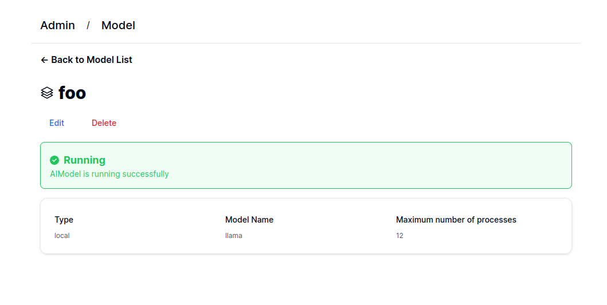

# Uplion Admin Panel

Admin panel for manage api keys and ai models.

## Environment Variables

1. `DATABASE_URL`：PostgreSQL database url
2. `IMAGE`: Image of worker node.
3. `REPLICAS`: Replicas for each aimodel, default is 3.
4. `MSG_BACKLOG_THRESHOLD`: Threshold number of tasks for KEDA, if set, otherwise KEDA is not enabled.

## Docker Image

`youxam/uplion-admin-panel:latest`
